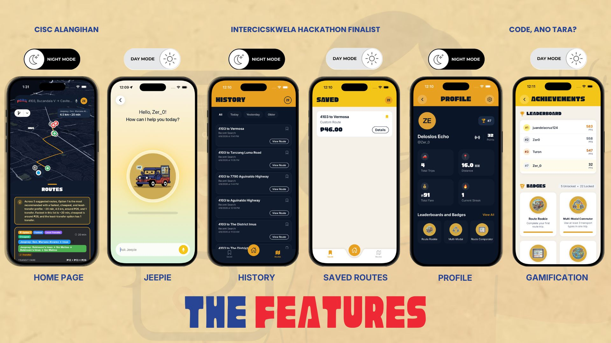

<div align="center">
  
  <h1>Para Mobile</h1>
  <p><strong>Local-First Commuter Navigation for Philippine Public Transport</strong></p>
  <p>
    <a href="https://expo.dev/"></a>
    <a href="https://reactnative.dev/"></a>
    <a href="https://www.typescriptlang.org/"></a>
    <a href="https://supabase.com/"></a>
    <a href="https://maplibre.org/"></a>
  </p>
  <p>
    <a href="#key-features">Key Features</a> |
    <a href="#installation-and-setup">Get Started</a> |
    <a href="#how-to-use">How to Use</a> |
    <a href="#contributing">Contributing</a>
  </p>
</div>

Para Mobile is a commuter-focused transit navigation app for the Philippines that helps users discover practical routes across jeepney, bus, tricycle, and UV Express networks.

## Project Description

Para Mobile was built to solve a common local commuting problem: traditional mapping tools often miss informal, community-curated, or rapidly changing transit paths.

The app combines map rendering, route search, and local transport data management into one mobile workflow that is useful for daily commuters.

### What the application does

- Finds route options across multiple public transport modes
- Recommends paths by speed, simplicity, and estimated fare impact
- Supports transfer-aware route planning and last-mile tricycle extensions
- Displays routes, POIs, and terminals on an interactive map
- Supports saved routes, commute history, achievements, points, and profile features

### Why this technology stack

- Expo and React Native: fast iteration and cross-platform mobile delivery
- Expo Router: predictable file-based navigation
- MapLibre React Native: open and customizable map rendering
- Supabase: simple backend for auth, realtime, and transit data storage
- Zustand and AsyncStorage: lightweight local-first state and caching
- Turf.js and custom search services: flexible geospatial routing logic

### Planned improvements

- Live traffic monitoring through a user-generated heat map
- Safe mode trip option for security-aware route recommendations
- LRT transit support as an additional mode
- Expanded route coverage and stronger route computation capability

## Key Features

- Unified Multi-Modal Routing: Plan trips across jeepney, bus, tricycle, and UV Express routes in one search flow.
- Transfer-Aware Recommendations: Compare route options optimized for speed, simplicity, and fare impact.
- Interactive Map Experience: Explore route overlays, stops, POIs, and terminals with a customized 3D map model.
- Local-First Reliability: Use cached transit data for resilient behavior when connectivity is unstable.
- Personalized Commute Tools: Save routes, track journey history, and monitor points and badges.
- Service Awareness Layer: Receive broadcast announcements and global offline status updates in-app.
- AI-Assisted Planning: Use conversational prompts to discover practical route options faster.
- Dark Mode and Light Mode: Switch between visual themes for better readability in day and night travel.

<p align="center">
  
</p>

## System Overview

- Mobile client built with React Native and Expo Router
- Map layer rendered via MapLibre with fallback style strategy
- Transit and user data managed through Supabase
- Route computation performed by in-app services using geospatial logic
- Importer pipeline normalizes route geometry and stop data before app use

## Tech Stack

| Category | Stack |
| --- | --- |
| Mobile Framework | React Native, Expo, Expo Router |
| Map Engine | MapLibre React Native |
| Backend | Supabase (Postgres, Auth, Realtime) |
| Geospatial Tools | Turf.js, custom route search engine |
| State Management | Zustand + AsyncStorage |
| Styling | Nativewind + StyleSheet |
| Device APIs | Expo Location, Expo Notifications, Expo Haptics |

## Installation and Setup

### Prerequisites

- Node.js 18+
- npm
- Expo-compatible Android or iOS development environment
- Supabase project for authenticated and synced features

### 1. Clone the repository

```bash
git clone https://github.com/JerichoDelosReyes/Para-Transport.git
cd Para-Transport
```

### 2. Install dependencies

```bash
npm install
```

### 3. Create a local environment file

Create a `.env` file in the root folder and define the required values below.

## Environment Variables

### Required (app runtime)

| Variable | Required | Description |
| --- | --- | --- |
| EXPO_PUBLIC_SUPABASE_URL | Yes | Supabase project URL |
| EXPO_PUBLIC_SUPABASE_ANON_KEY | Yes | Supabase anon key |

### Required (importer and admin scripts)

| Variable | Required | Description |
| --- | --- | --- |
| SUPABASE_SERVICE_ROLE_KEY | Yes (scripts) | Service-role key for importers and maintenance scripts |

### Optional (map and geocoding)

| Variable | Description |
| --- | --- |
| EXPO_PUBLIC_GEOCODING_BASE_URL | Geocoding base URL (default: Nominatim) |
| EXPO_PUBLIC_MAPLIBRE_STYLE_URL | Explicit MapLibre style URL |
| EXPO_PUBLIC_PARAGIS_STYLE_STRATEGY | Style resolution strategy |
| EXPO_PUBLIC_PARAGIS_STYLE_URL_PINNED | Pinned style URL |
| EXPO_PUBLIC_PARAGIS_STYLE_URL_FALLBACK | Fallback style URL |
| EXPO_PUBLIC_PARAGIS_STYLE_URL_LIGHT | Light mode style URL |
| EXPO_PUBLIC_PARAGIS_STYLE_URL_DARK | Dark mode style URL |
| EXPO_PUBLIC_MAPTILER_KEY | Optional MapTiler key |
| EXPO_PUBLIC_MAPTILER_STYLE | Optional MapTiler style |
| EXPO_PUBLIC_OSM_TILE_URL | Optional custom OSM raster tile URL |
| EXPO_PUBLIC_LIGHT_TILE_URL | Optional alternate light tile URL |
| EXPO_PUBLIC_FEATURE_USE_MAPLIBRE | Feature flag for map renderer |

### Optional (chatbot)

| Variable | Description |
| --- | --- |
| EXPO_PUBLIC_GROQ_API_KEY | Chatbot API key |
| EXPO_PUBLIC_GROQ_GUARDRAIL_API_KEY | Optional guardrail API key |

## Run the Project

Recommended command for native modules and map support:

```bash
npx expo start --dev-client --lan --clear
```

Common alternatives:

```bash
npm run start
npm run android
npm run ios
npm run web
```

## How to Use

### Basic commuter flow

1. Launch the app and allow location permission for better map context.
2. Search for an origin and destination.
3. Review recommended routes (fastest, easiest, cheapest).
4. Open a route to inspect segments, transfers, and map overlays.
5. Save useful routes and revisit them from saved and history screens.

### Usage examples for contributors

- Generate fallback tricycle terminal data:

```bash
npm run generate:tricycle-terminals-fallback
```

- Find candidate extension test pairs:

```bash
npm run find:tricycle-extension-tests
```

- Import tricycle terminals from GPX:

```bash
npm run import:tricycle-terminals
```

- Verify imported terminal output:

```bash
npm run verify:tricycle-terminals
```

## Credits

Core contributors (based on repository history):

- Jericho Delos Reyes: https://github.com/JerichoDelosReyes
- Adrian Norona: https://github.com/adrianorona
- Lance Acal: https://github.com/lncadrnn
- Christian Valenzuela: https://github.com/noxen-cv

## References and Learning Resources

- Expo docs: https://docs.expo.dev/
- Expo Router docs: https://docs.expo.dev/router/introduction/
- MapLibre React Native docs: https://maplibre.org/maplibre-react-native/docs/
- Supabase docs: https://supabase.com/docs
- Turf.js docs: https://turfjs.org/
- OpenStreetMap and Overpass Turbo: https://www.openstreetmap.org/ and https://overpass-turbo.eu/
- License chooser: https://choosealicense.com/

## Security

For vulnerability reporting and security procedures, see [SECURITY.md](SECURITY.md).

## License

This repository currently does not declare a final license.

Until a license file is added, all rights are reserved by default. If you want open usage and external contributions, add a `LICENSE` file (for example MIT or GPL-3.0) and update this section.
