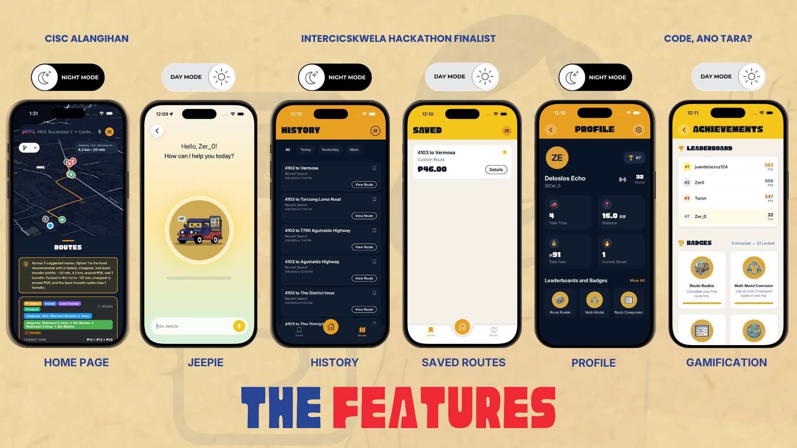
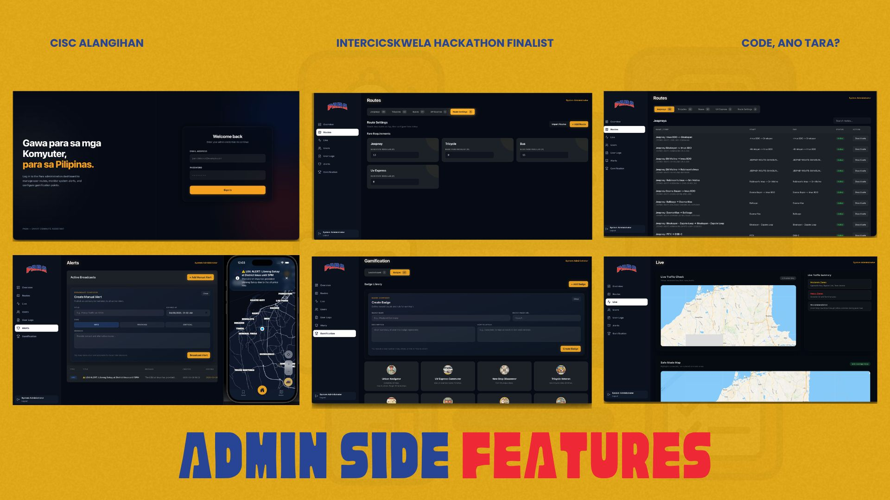

<div align="center">
  
  <h1>Para Mobile</h1>
  <p><strong>Local Commuter Navigation for Philippine Public Transport</strong></p>
  <p>
    <a href="https://expo.dev/"></a>
    <a href="https://reactnative.dev/"></a>
    <a href="https://www.typescriptlang.org/"></a>
    <a href="https://supabase.com/"></a>
    <a href="https://maplibre.org/"></a>
    <a href="https://groq.com/"></a>
    <a href="https://polygon.technology/"></a>
  </p>
  <p>
    <a href="#key-features">Key Features</a> |
    <a href="#installation-and-setup">Get Started</a> |
    <a href="#contributing">Contributing</a>
  </p>
</div>

Para Mobile is a commuter-focused transit navigation app for the Philippines that helps users discover practical routes across jeepney, bus, tricycle, and UV Express networks.

## Project Description

Para Mobile was built to solve a common local commuting problem: traditional mapping tools often miss informal, community-curated, or rapidly changing transit paths.

The app combines map rendering, route search, and local transport data management into one mobile workflow that is useful for daily commuters.

### What the application does

- Finds route options across multiple public transport modes
- Recommends paths by speed, simplicity, and estimated fare impact
- Supports transfer-aware route planning and last-mile tricycle extensions
- Displays routes, POIs, and terminals on an interactive map
- Supports saved routes, commute history, achievements, points, and profile features
- Answers commuting questions through Jeepie, a retrieval-augmented (RAG) in-app chatbot grounded in Para's own knowledge base
- Rewards trips and achievements on-chain through the Para blockchain rewards system (PRT points token + NFT badges)

### Planned improvements

- Libreng Sakay tracker for free-ride service availability and schedules
- LRT/MRT tracker as an additional rail transit mode
- Night mode that prioritizes well-lit and safer community routes
- Live traffic monitoring through a user-generated heat map
- Safe mode trip option for security-aware route recommendations
- Expanded route coverage and stronger route computation capability

## Key Features

- Unified Multi-Modal Routing: Plan trips across jeepney, bus, tricycle, and UV Express routes in one search flow.
- Transfer-Aware Recommendations: Compare route options optimized for speed, simplicity, and fare impact.
- Interactive Map Experience: Explore route overlays, stops, POIs, and terminals with a customized 3D map model.
- Local-First Reliability: Use cached transit data for resilient behavior when connectivity is unstable.
- Personalized Commute Tools: Save routes, track journey history, and monitor points and badges.
- Service Awareness Layer: Receive broadcast announcements and global offline status updates in-app.
- Jeepie, the RAG-Powered Assistant: Ask commuting questions in natural language and get answers grounded in Para's own knowledge base, with an out-of-scope guardrail so it stays on-topic.
- Blockchain Rewards: Earn PRT loyalty points and collectible achievement badges minted as on-chain tokens (ERC-20 / ERC-721) on Polygon, redeemable for vouchers.
- Dark Mode and Light Mode: Switch between visual themes for better readability in day and night travel.

<p align="center">
  
</p>

## Admin side of Para

- Admin dashboard for system control
- Push notifications (e.g., Libre Sakay alerts)
- Manual fare updates (real-world changes)
- GPX route import for fast data setup
- Route monitoring (jeep • bus • tricycle)
- Analytics & user insights
- User activity logs

<p align="center">
  
</p>

## System Overview

- Mobile client built with React Native and Expo Router
- Map layer rendered via MapLibre with fallback style strategy
- Transit and user data managed through Supabase
- Route computation performed by in-app services using geospatial logic
- Importer pipeline normalizes route geometry and stop data before app use
- Jeepie chatbot runs as a Supabase Edge Function: the knowledge base is chunked and embedded into `pgvector`, incoming questions are matched by similarity search, and a Groq-hosted LLM generates the grounded reply (with a similarity guardrail that declines out-of-scope questions)
- Blockchain rewards run on Polygon: Solidity contracts (`ParaToken` ERC-20 for points, `ParaBadge` ERC-721 for achievements) are minted through Supabase Edge Functions using a custodial backend wallet, so users don't need to manage a wallet or gas themselves

## Tech Stack

| Category | Stack |
| --- | --- |
| Mobile Framework | React Native, Expo, Expo Router |
| Map Engine | MapLibre React Native |
| Backend | Supabase (Postgres, Auth, Realtime, Edge Functions) |
| Geospatial Tools | Turf.js, custom route search engine |
| AI / RAG Chatbot | Supabase `pgvector` embeddings + Groq (Llama 3.1) for grounded, retrieval-augmented answers |
| Blockchain Rewards | Solidity (Hardhat, OpenZeppelin) on Polygon — ERC-20 points token (PRT) and ERC-721 achievement badges |
| State Management | Zustand + AsyncStorage |
| Styling | Nativewind + StyleSheet |
| Device APIs | Expo Location, Expo Notifications, Expo Haptics |

## Installation and Setup

### Prerequisites

- Node.js 18+
- npm
- Expo-compatible Android or iOS development environment
- Supabase project for authenticated and synced features

### 1. Clone the repository

```bash
git clone https://github.com/JerichoDelosReyes/Para-Transport.git
cd Para-Transport
```

### 2. Install dependencies

```bash
npm install
```

## Credits

Core contributors:

- Jericho Delos Reyes: https://github.com/JerichoDelosReyes
- Adrian Norona: https://github.com/adrianorona
- Lance Acal: https://github.com/lncadrnn
- Christian Valenzuela: https://github.com/noxen-cv

## References and Learning Resources

- Expo docs: https://docs.expo.dev/
- Expo Router docs: https://docs.expo.dev/router/introduction/
- MapLibre React Native docs: https://maplibre.org/maplibre-react-native/docs/
- Supabase docs: https://supabase.com/docs
- Supabase pgvector docs: https://supabase.com/docs/guides/ai/vector-columns
- Groq API docs: https://console.groq.com/docs
- Hardhat docs: https://hardhat.org/docs
- OpenZeppelin Contracts docs: https://docs.openzeppelin.com/contracts
- Polygon docs: https://docs.polygon.technology/
- Turf.js docs: https://turfjs.org/
- OpenStreetMap and Overpass Turbo: https://www.openstreetmap.org/ and https://overpass-turbo.eu/
- License chooser: https://choosealicense.com/

## Security

For vulnerability reporting and security procedures, see [SECURITY.md](SECURITY.md).

## License

This repository currently does not declare a final license.

Until a license file is added, all rights are reserved by default. If you want open usage and external contributions, add a `LICENSE` file (for example MIT or GPL-3.0) and update this section.
